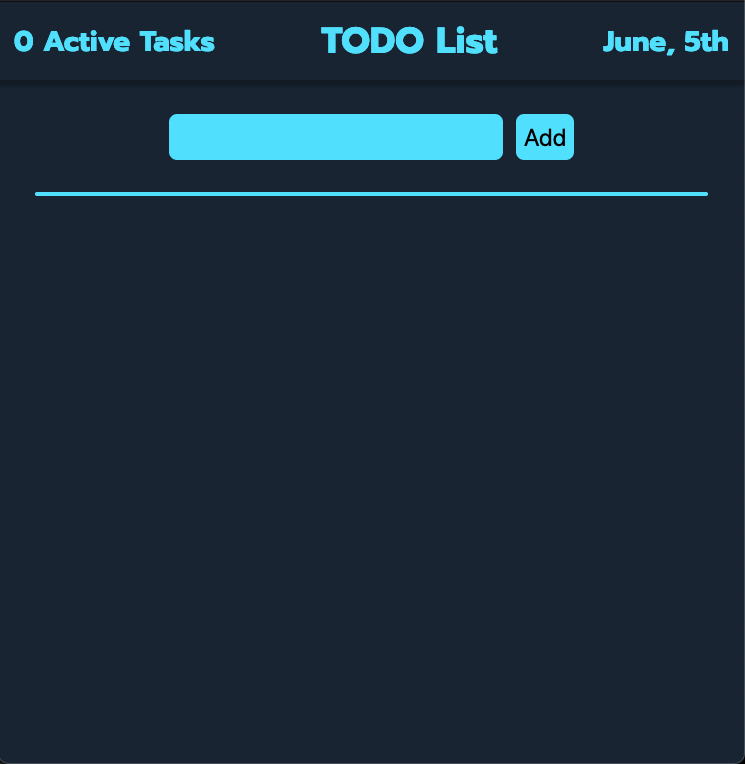
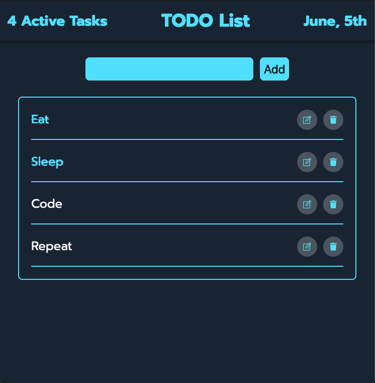

# ToDo List

A simple ToDo List application built with vanilla JavaScript, HTML, and CSS. This project allows users to add and remove tasks, with a dynamic count of active tasks. Currently, tasks do not persist across sessions, but future updates may include local storage functionality.

<a href='https://davejamieson.github.io/toDoList/'>Try It Out Here!!</a>





## Features

- Add new tasks
- Remove tasks
- Active tasks count
- ~~Strike through completed tasks~~

## Getting Started

### Prerequisites

- [Visual Studio Code (VS Code)](https://code.visualstudio.com/)
- [Live Server extension for VS Code](https://marketplace.visualstudio.com/items?itemName=ritwickdey.LiveServer)

### Installation

1. **Clone the repository:**
    ```sh
    git clone https://github.com/yourusername/toDoList.git
    ```
2. **Navigate to the project directory:**
    ```sh
    cd toDoList
    ```
3. **Open the project in VS Code:**
    ```sh
    code .
    ```
4. **Start Live Server:**
    - Open the `index.html` file.
    - Right-click on the file and select "Open with Live Server".

### Usage

1. Open the application in your web browser via Live Server.
2. Use the input field to add new tasks.
3. Click on the "Add" button to add the task to the list.
4. Click on the trash bin icon next to a task to remove it.

## File Structure
```plaintext
toDoList/
├── .vscode/
│   └── settings.json
├── index.html
├── main.css
├── main.js
├── note-square-outlined-button-with-a-pencil.png
└── trash-bin.png
```

- **.vscode/**: Contains settings for VS Code.
- **index.html**: The main HTML file for the application.
- **main.css**: The stylesheet for the application.
- **main.js**: The JavaScript file containing the logic for the ToDo List.
- **note-square-outlined-button-with-a-pencil.png**: An icon used in the application.
- **trash-bin.png**: An icon used in the application.

## Contributing

Contributions are welcome! Please open an issue or submit a pull request for any changes or enhancements.

## License

This project is licensed under the MIT License. See the [LICENSE](LICENSE) file for details.

## Contact

For any inquiries, please reach out to:

- Dave - [davejtake2@gmail.com](mailto:davejtake2@gmail.com)
- GitHub: [DaveJamieson](https://github.com/DaveJamieson)
